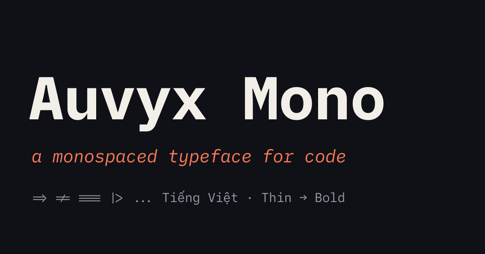
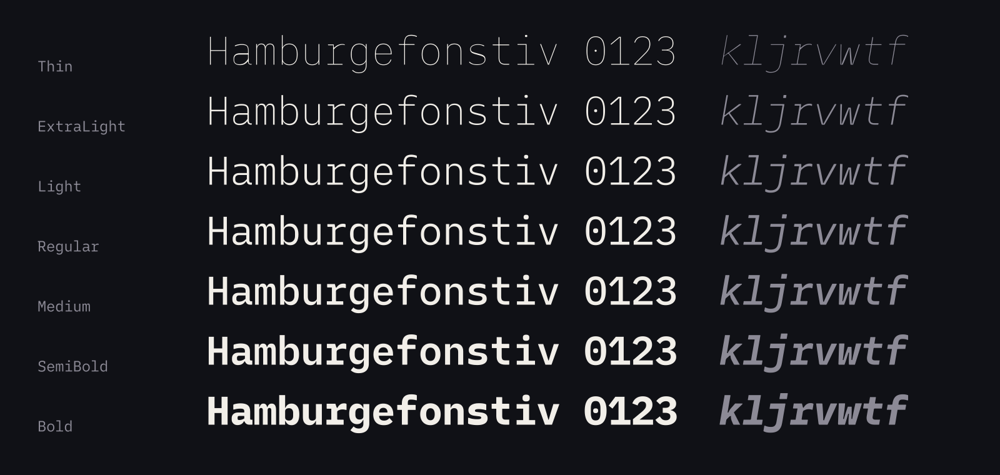
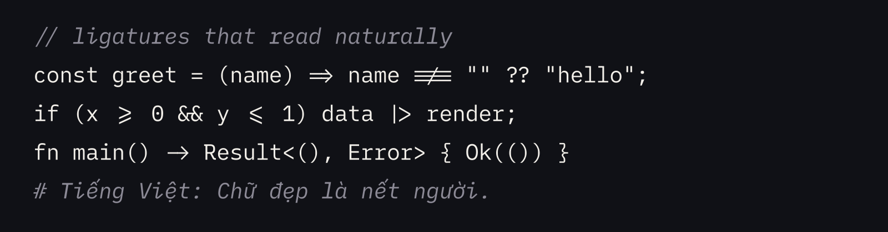
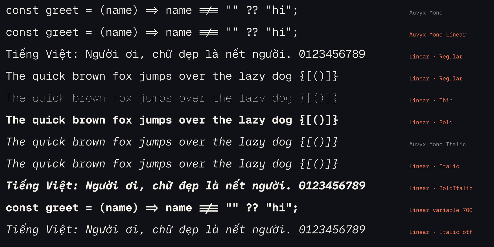
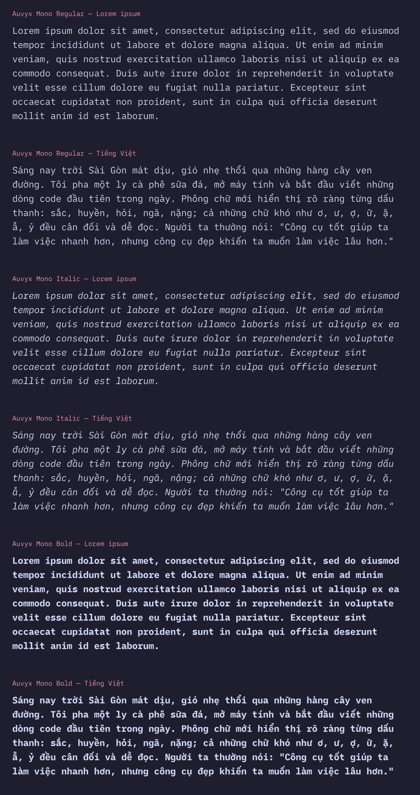

<p align="center">
  
</p>

# Auvyx Mono

[](https://github.com/lamtanloc512/auvyx_mono/actions/workflows/ci.yaml)
[](https://github.com/lamtanloc512/auvyx_mono/releases/latest)
[](OFL.txt)

**[Website](https://lamtanloc512.github.io/auvyx_mono/)** · **[Download](https://github.com/lamtanloc512/auvyx_mono/releases/latest)** · **[Try it](https://lamtanloc512.github.io/auvyx_mono/#tester)**

Auvyx Mono is a free, open-source monospaced typeface for code. Calm, legible and a little bit warm — with
seven weights from Thin to Bold, true italics, programming ligatures, 1,073 characters and careful Vietnamese
support. Available as static TTF/OTF, variable TTF and WOFF2.

<p align="center"></p>
<p align="center"></p>

## Features

- **7 weights + variable font** — `wght` 100–700, upright and italic.
- **True italics, without flourishes** — single-storey `a` and `g`, the signature `i`, clean `k l j r v w t f y`, straight `x` and `z`.
- **Ligatures** — `=> != === |> :: && <= /* */ <!--` … turn them off with `calt` if you prefer.
- **Character variants** — slashed/plain/backslashed zero, double-storey `g`, high asterisk, curvier parentheses and more (`cv02 cv04 cv06 cv08–cv11 cv13–cv15 zero ss01–ss04`).
- **Languages** — Latin (incl. Vietnamese), Greek and Cyrillic; box drawing and Powerline symbols.
- **Consistent spacing** — a 600-unit cell, matching Recursive Mono Linear.

### Auvyx Mono Linear

A sister family whose upright uses the Latin letters and figures of [Geist Mono](https://github.com/vercel/geist-font)
(weight-matched; `l` from Recursive), while the italic is identical to Auvyx Mono's. Symbols, ligatures and box drawing are shared.
Built with `make auvyx-linear` → `fonts/AuvyxMonoLinear` (config: [`sources/auvyx_linear.yaml`](sources/auvyx_linear.yaml)).

<p align="center"></p>

<p align="center"></p>

## Install

Download the [latest release](https://github.com/lamtanloc512/auvyx_mono/releases/latest) (or build it yourself, see below), then:

- **macOS** — open `variable/`, select both `.ttf` files, double-click → *Install Font*.
- **Windows** — select both `.ttf` files in `variable/`, right-click → *Install for all users*.
- **Linux** — copy the `.ttf` files to `~/.local/share/fonts` and run `fc-cache -f`.

Editor setup, e.g. VS Code:

```json
"editor.fontFamily": "'Auvyx Mono', monospace",
"editor.fontLigatures": true
```

## Build

```sh
make auvyx            # build fonts/AuvyxMono from the prebuilt base fonts (Python + fonttools, pyyaml, uharfbuzz, numpy, scipy, freetype-py)
make auvyx-install    # install the variable fonts on macOS
make auvyx-linear     # build Auvyx Mono Linear (fonts/AuvyxMonoLinear)
make configure && make auvyx-build   # full build from the .glyphs sources
```

All Auvyx-specific changes (family name, cell width, default alternates, borrowed glyphs, weight matching) are
declared in [`sources/auvyx.yaml`](sources/auvyx.yaml) and applied by [`scripts/auvyx.py`](scripts/auvyx.py).

## Website & video

The website lives in [`website/`](website) (Astro, static, SEO-ready). The intro video is rendered from code in
[`website/video/`](website/video).

```sh
make website-configure   # npm install
make website-fonts       # copy the freshly built fonts into the site
make website-serve       # http://localhost:4321
make website-build       # → website/dist
make video               # → website/video/auvyx-mono-intro.mp4
```

## Releasing

Every push to `main` builds the fonts and deploys the website to GitHub Pages. To publish a release with a
downloadable zip, push a tag:

```sh
git tag v1.0.0 && git push origin v1.0.0
```

## Credits & license

Auvyx Mono is released under the [SIL Open Font License 1.1](OFL.txt).

It is a modified version of [Lilex](https://github.com/mishamyrt/Lilex) by Mikhael Khrustik, itself based on
[IBM Plex Mono](https://github.com/IBM/plex). Some letters come from [Recursive](https://github.com/arrowtype/recursive)
(Arrow Type) and [Geist Mono](https://github.com/vercel/geist-font) (Vercel), both under the OFL.
See [OFL.txt](OFL.txt) and [AUTHORS](AUTHORS) for the full copyright notices.

Internal source file names (`sources/Lilex/*.glyphs`, `lilexgen`) are kept unchanged so upstream improvements
can still be merged:

```sh
git remote add upstream https://github.com/mishamyrt/Lilex   # if not already added
git fetch upstream && git merge upstream/master && make auvyx
```
